Opérations sur les limites

1.  Limites usuelles

1.  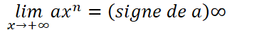
2.  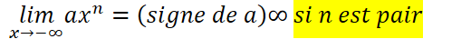
3.  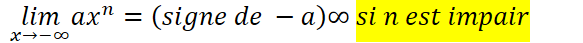
4.  
2.  Limite d’une fonction polynôme
    1.  Propriétés
        1.  
        2.  La limite d'un polynôme en ∞ est celle de son terme de plus haut degré
3.  Limite d’une fonction rationnelle
    1.  Propriétés
        1.  La limite d’une fonction rationnelle en ∞ est celle du quotient des termes de plus haut degré
        2.  

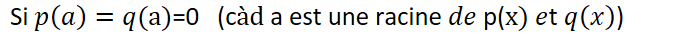

4.  Limite d’une fonction irrationnelle
    1.  Propriétés
        1.  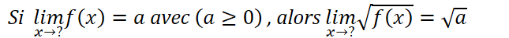
        2.  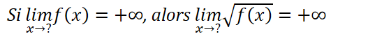
5.  Opérations sur les limites
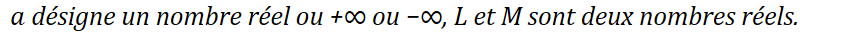
1.  Limite de la somme de deux fonctions
| 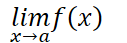 | 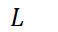 |  | 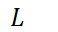 | 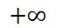 | 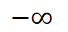 | 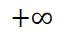 |
|--------------------------------------------------------------------------------------------------------------------------|--------------------------------------------------------------------------------------------------------------------------|--------------------------------------------------------------------------------------------------------------------------|--------------------------------------------------------------------------------------------------------------------------|--------------------------------------------------------------------------------------------------------------------------|--------------------------------------------------------------------------------------------------------------------------|--------------------------------------------------------------------------------------------------------------------------|
| 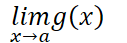 | 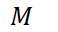 | 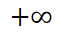 | 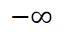 | 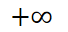 | 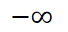 | 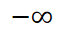 |
| 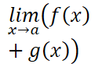 | 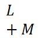 | 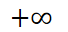 | 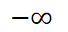 |  |  | 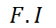 |
2.  Limite du produit de deux fonctions
| 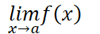  |  | 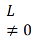 | 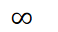 | 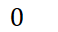 |
|--------------------------------------------------------------------------------------------------------------------------|--------------------------------------------------------------------------------------------------------------------------|--------------------------------------------------------------------------------------------------------------------------|--------------------------------------------------------------------------------------------------------------------------|--------------------------------------------------------------------------------------------------------------------------|
| 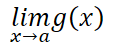  | 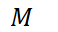 | 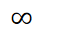 |  | 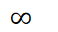 |
| 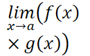 | 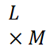 | 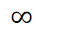 | 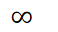 | 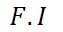 |
3.  Limite du quotient de deux fonctions
| 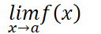 | 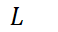 | 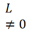 | 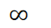 | 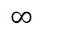 | 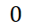 |
|--------------------------------------------------------------------------------------------------------------------------|--------------------------------------------------------------------------------------------------------------------------|--------------------------------------------------------------------------------------------------------------------------|--------------------------------------------------------------------------------------------------------------------------|--------------------------------------------------------------------------------------------------------------------------|--------------------------------------------------------------------------------------------------------------------------|
|  | 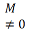 | 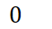 | 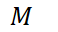 | *∞*                                                                                                                      |  |
| 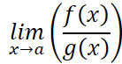  | 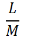 |  |  | 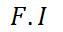 |  |
6.  Limites et ordre
    1.  Théorèmes
        1.  
            1.  
            2.  
        2.  
            1.  
            2.  
